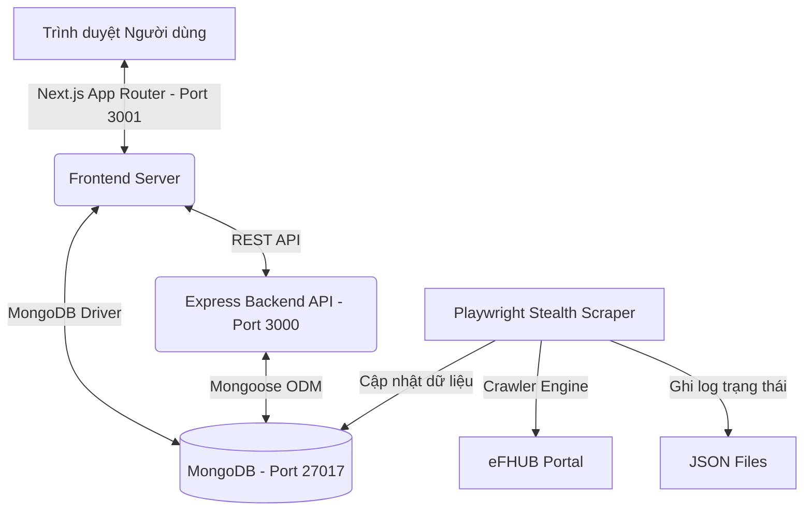

<p align="center">
  
</p>

<p align="center">
  
  
  
  
  
  
</p>

---

# ⚽ eFootball Hub VN — Hệ Sinh Thái Cơ Sở Dữ Liệu & Công Cụ Chiến Thuật Chuyên Sâu

Chào mừng bạn đến với **eFootball Hub VN**, nền tảng tối thượng cung cấp kho dữ liệu cầu thủ, huấn luyện viên chuyên sâu, giả lập tăng chỉ số (build), so sánh đối đầu và xây dựng đội hình chiến thuật chuẩn chỉnh nhất dành riêng cho cộng đồng eFootball Việt Nam.

Dự án được xây dựng bằng kiến trúc Full-stack hiện đại, tận dụng tối đa sức mạnh của **Next.js 15 App Router**, **Express.js API Engine**, kết nối cơ sở dữ liệu **MongoDB** bền vững và tích hợp hệ thống tự động cào dữ liệu ẩn danh thông minh (**Playwright Stealth Scraper**). Trải nghiệm người dùng được chau chuốt kỹ lưỡng với thiết kế kính mờ (**Glassmorphism**) mang đậm phong cách thể thao điện tử, hiển thị mượt mà trên cả máy tính lẫn mọi thiết bị di động.

---

## 🚀 Tính Năng Nổi Bật & Độc Quyền

### 1. Song Ngữ (Bilingual Mode) Chuyên Sâu & Đồng Bộ
Tất cả các thông số chuyên sâu về cầu thủ được thiết lập song ngữ dựa trên thuật ngữ chuẩn của cộng đồng eFootball Việt Nam, đồng thời giữ nguyên hoàn toàn các tên riêng (tên cầu thủ, huấn luyện viên, câu lạc bộ, giải đấu) đúng như nguyên bản:
*   **Vị trí (Positions):** `CF (Tiền đạo cắm)`, `SS (Tiền đạo cánh ảo)`, `AMF (Tiền vệ tấn công)`, `DMF (Tiền vệ phòng ngự)`, `CB (Trung vệ)`, `LB/RB (Hậu vệ cánh trái/phải)`, `GK (Thủ môn)`,...
*   **Phong cách chơi (Playstyles):** `Goal Poacher (Kẻ săn bàn)`, `Box-to-Box (Tiền vệ con thoi)`, `Anchor Man (Tiền vệ mỏ neo)`, `Creative Playmaker (Nhạc trưởng sáng tạo)`, `Fox in the Box (Sát thủ vòng cấm)`, `Destroyer (Kẻ hủy diệt)`,...
*   **Kỹ năng cầu thủ (Skills & COM Playstyles):** `Double Touch (Gạt bóng hai chân)`, `Marseille Turn (Xoay compa)`, `One-touch Pass (Chuyền một chạm)`, `First Time Shot (Dứt điểm một chạm)`, `Acrobatic Finishing (Móc bóng / Vô-lê)`,...
*   **Chỉ số thuộc tính (Stats/Attributes):** `Attacking Prowess (Nhận thức tấn công)`, `Dribbling (Rê bóng)`, `Kicking Power (Lực sút)`, `Physical Contact (Tranh chấp tì đè)`, `GK Reflexes (Phản xạ thủ môn)`,...
*   **Bản đồ tăng điểm (Build Engine):** Các danh mục nâng cấp chỉ số hiển thị song ngữ trực quan: `Lower Body Strength (Sức mạnh thân dưới / Lực chân)`, `Aerial Strength (Không chiến / Tranh chấp)`, `Defending (Phòng ngự)`, `GK 1 (Phản xạ / Bắt bóng)`,...

### 2. Trình Giả Lập Tăng Điểm Đỉnh Cao (Player Build Engine)
*   **Tự động nâng chỉ số:** Mô phỏng nâng Progression Points từ Level 1 đến Cấp tối đa (Max Level).
*   **Các bộ tối ưu nhanh:** Một click chuột để tự động cộng điểm theo các chiến thuật khác nhau (**Smart**, **Attack**, **Creative**, **Defense**, **GK**).
*   **Tính toán phong độ thực tế (Player Form):** Tự động thay đổi chỉ số thuộc tính thời gian thực khi chọn trạng thái phong độ (Mũi tên Xanh lá đi lên $\uparrow$, Mũi tên Cam đi xuống $\downarrow$,...).
*   **Chia sẻ cộng đồng:** Lưu cấu hình nâng điểm cá nhân trực tiếp trên cookie phiên người dùng hoặc xuất bản công khai lên trang **Cộng đồng** để thảo luận.

### 3. Công Cụ So Sánh Đối Đầu Trực Quan (Player Comparison)
*   Đặt hai cầu thủ lên bàn cân so sánh chỉ số thuộc tính chi tiết.
*   Hiển thị biểu đồ radar và bảng chênh lệch chỉ số rõ ràng (Diff value).
*   Hỗ trợ tinh chỉnh cấp độ và trạng thái phong độ riêng biệt cho từng cầu thủ để giả lập cuộc đối đầu thực tế nhất trên sân bóng.

### 4. Bảng Xây Dựng Đội Hình Canvas (Lineup Builder)
*   Tự do thiết lập các sơ đồ chiến thuật phổ biến (`4-3-3`, `4-2-3-1`, `4-4-2`, `3-4-3`, `3-5-2`, `5-2-1-2`).
*   Kéo thả cầu thủ mượt mà trên sơ đồ canvas.
*   Chọn huấn luyện viên (HLV) ưa thích và tính toán chính xác chỉ số tổng quan tăng thêm (Tactical Boosts) dựa trên điểm lối chơi của HLV, mô phỏng đúng cơ chế Chemistry trong game.

### 5. Từ Điển 73+ Tính Năng & Kỹ Năng Chuyên Sâu (`/tinh-nang`)
*   Bảng tra cứu đồ sộ giải thích 73+ kỹ năng cầu thủ và phong cách chơi.
*   **Đặc biệt:** Mỗi mục tính năng được biên soạn công phu dài 150-300 từ bằng **Gemini AI**, tích hợp **hướng dẫn nút bấm tay cầm PlayStation/Xbox chi tiết** để thực hiện kỹ thuật và các mẹo chơi chuyên nghiệp (Pro Tips).
*   Giao diện Glassmorphism Popup hiển thị tối ưu trên cả Desktop và Mobile.

### 6. Thư Viện Cẩm Nang Học Viện Cao Cấp (`/cam-nang`)
*   Nơi hội tụ hơn 13 cẩm nang chi tiết giải quyết mọi câu hỏi hóc búa của game thủ: bẫy chỉ số OVR, trạng thái mũi tên phong độ, bứt tốc đẩy bóng Sharp Touch, Match-up Defense, và đặc biệt là kỹ thuật tối thượng **Super Cancel (R1+R2 / RB+RT)**.
*   Tích hợp thanh tìm kiếm thời gian thực (Live Search) và tab phân loại thông minh giúp tra cứu tức thì trong vài giây.

### 7. Góc Meta: Phân Tích Chuyên Sâu 5 Lối Chơi Đồng Đội (Team Playstyles)
*   Phân tích chi tiết và sâu sắc nhất về 5 phong cách chơi cốt lõi của game Konami eFootball:
    *   **Possession Game (Kiểm soát bóng):** Cự ly đội hình ngắn, di chuyển hỗ trợ tạo tam giác chuyền bóng liên tục.
    *   **Quick Counter (Phản công nhanh):** Dâng cao đội hình cực nhanh ngay khi đoạt bóng, áp đặt lối chơi pressing tầm cao (High-line).
    *   **Long Ball Counter (Phản công bóng dài):** Hàng thủ lùi sâu bảo vệ vòng cấm (Low-block), tiền đạo bứt tốc nhận đường chuyền dài vượt tuyến.
    *   **Out Wide (Tấn công biên):** Kéo dãn đội hình ra hai biên, tạt bóng đánh đầu hoặc cắt bóng từ biên vào trung lộ.
    *   **Long Ball (Bóng dài):** Lối chơi cổ điển, rót bóng trực tiếp đến vị trí tiền đạo mục tiêu tranh chấp bóng hai.
*   **Đặc biệt:** Mỗi lối chơi đi kèm **sơ đồ chiến thuật 2D độc quyền nét cao (high-fidelity tactical board)**, thể hiện chính xác các đường chuyền, hướng chạy và vị trí đội hình.

### 8. Công Cụ Viết Bài Trực Tuyến Dành Cho Admin (Admin Guide Panel)
*   Một trang Admin kín đáo và an toàn ngay trong mục `/cam-nang` giúp quản trị viên dễ dàng viết bài viết cẩm nang mới.
*   Admin có thể nhập tiêu đề, tóm tắt, nội dung dài, phân loại bài viết và đính kèm sơ đồ chiến thuật trực quan chỉ trong vài giây.
*   Bài viết xuất bản sẽ tự động lưu vĩnh viễn vào **MongoDB** và đẩy thẳng ra vị trí ưu tiên ngoài **Trang chủ** để tiếp cận toàn bộ người dùng.

---

## 🛠️ Kiến Trúc Hệ Thống & Công Nghệ

Hệ thống được phát triển theo cấu trúc phân tách dịch vụ chuẩn chỉnh, đảm bảo tính bảo mật và hiệu năng chịu tải cao:



*   **Next.js 15 Frontend (`/next-app`):** Tối ưu hóa Static Page Generation (SSG) kết hợp Dynamic Server Rendering cho các trang tìm kiếm nóng. Sử dụng Tailwind CSS v3 cho phong cách thiết kế kính mờ (Glassmorphism).
*   **Express API Server (`/src`):** Cung cấp API lõi phục vụ đồng bộ dữ liệu, phân trang tìm kiếm nâng cao và lưu vết hoạt động. Tích hợp giới hạn tần suất chống spam (API Rate Limiting).
*   **Stealth Scraper (`/src/scraper`):** Sử dụng thư viện **Playwright** kết hợp cấu hình Stealth (thay đổi User-Agent liên tục, đặt thời gian trễ ngẫu nhiên 5-12 giây, mô phỏng thao tác chuột) để cào thông số chính xác từ eFHUB mà không bị chặn IP.
*   **MongoDB Storage:** Quản lý hàng ngàn bản ghi cầu thủ và huấn luyện viên với cấu trúc chỉ mục composite thông minh (Composite Indexes) đảm bảo tốc độ tìm kiếm < 5ms.

---

## 📁 Cấu Trúc Thư Mục Chi Tiết

```text
.
├── src/                               # 🟢 Express.js API & Scraper Backend
│   ├── config/                        # Cấu hình Database & Biến môi trường
│   ├── controllers/                   # Xử lý các nghiệp vụ API (Players, Managers)
│   ├── middleware/                    # Rate Limiting & Bảo mật chống tấn công
│   ├── models/                        # Lược đồ MongoDB Mongoose (Player, Manager, Pack)
│   ├── routes/                        # Các tuyến định tuyến API backend
│   ├── scraper/                       # Playwright stealth scraper crawler engine
│   ├── services/                      # Nghiệp vụ xử lý dữ liệu và logic game
│   ├── jobs/                          # Cron scheduler đồng bộ định kỳ theo giờ VN
│   └── server.js                      # Điểm chạy máy chủ Express API (Port 3000)
│
├── next-app/                          # 🔵 Next.js 15 Frontend Web App
│   ├── app/                           # Cấu trúc App Router của Next.js (Pages & API)
│   │   ├── cau-thu/                   # Bộ lọc tìm kiếm & chi tiết stats cầu thủ
│   │   ├── so-sanh/                   # So sánh radar chỉ số & phong độ
│   │   ├── doi-hinh/                  # Xây dựng sơ đồ chiến thuật kéo thả
│   │   ├── cong-cu/                   # Trung tâm công cụ so sánh, tính điểm
│   │   └── cam-nang/                  # Thư viện cẩm nang, lối chơi, Admin panel
│   ├── components/                    # Các UI Components cao cấp (guides, lineup, glossary...)
│   ├── lib/                           # Logic gameplay engine, MongoDB client & Translations
│   │   └── utils/
│   │       └── translations.ts        # Bộ dịch thuật song ngữ Anh - Việt chuẩn hóa
│   ├── public/                        # Thư mục chứa tài nguyên tĩnh (Fonts, Images, Icons)
│   │   └── images/
│   │       └── playstyles/            # Ảnh sơ đồ chiến thuật lối chơi chuẩn Meta
│   ├── tests/                         # Bộ kiểm thử Parity và snapshot chất lượng
│   └── package.json                   # Cấu hình Next.js (Port 3001)
│
├── scraped-output/                    # Dữ liệu cào JSON & Hạt giống seed ban đầu
└── mongodb-local/                     # MongoDB nhúng cục bộ cho macOS
```

---

## 💻 Hướng Dẫn Cài Đặt & Khởi Chạy Từ Đầu

> [!IMPORTANT]
> **Yêu cầu hệ thống tối thiểu:**
> *   **Node.js** >= 18.x
> *   **npm** >= 9.x
> *   **Hệ điều hành:** macOS (để chạy MongoDB tích hợp sẵn) hoặc Windows/Linux (cần cài MongoDB riêng).

### Bước 1: Cài đặt Dependencies cho cả 2 dự án
Mở terminal tại thư mục gốc dự án:
```bash
# 1. Cài đặt dependencies cho Express Backend & Scraper
npm install

# 2. Di chuyển vào thư mục next-app và cài đặt cho Next.js Frontend
cd next-app
npm install
```

### Bước 2: Thiết lập cấu hình Môi trường
Tạo tệp `.env` tại thư mục gốc bằng cách nhân bản mẫu `.env.example`:
```bash
cp .env.example .env
```
Mở tệp `.env` và đảm bảo các cấu hình như sau:
```env
PORT=3000
MONGODB_URI=mongodb://127.0.0.1:27017/efootball_vn
DB_REQUIRED=true
NEXT_APP_PORT=3001
```

### Bước 3: Khởi chạy Database MongoDB
Dự án được phân phối kèm theo MongoDB cục bộ cho macOS trong thư mục `mongodb-local/`. Hãy khởi chạy tiến trình database:
```bash
# Thực hiện tại thư mục gốc dự án
./mongodb-local/server/bin/mongod --dbpath ./mongodb-local/data
```
*Cơ sở dữ liệu sẽ chạy ngầm và lắng nghe tại cổng mặc định `27017`.*

### Bước 4: Khởi tạo Index & Gieo Hạt Dữ Liệu Thực (Seeding Database)
Sau khi máy chủ MongoDB đã hoạt động, hãy khởi tạo các bộ chỉ mục tìm kiếm và nạp dữ liệu cào chuẩn hóa:
```bash
# Di chuyển vào thư mục next-app
cd next-app

# 1. Khởi tạo các Index composite tăng tốc truy vấn cho MongoDB
npm run db:indexes

# 2. Nhập dữ liệu hạt giống cầu thủ siêu sao, HLV và bài viết cẩm nang mẫu vào DB
npm run import:data
```
*Hệ thống sẽ nạp trực tiếp danh sách hơn 40 siêu sao (Haaland, Bellingham, Rodri,...), 3 HLV hàng đầu và các bài viết lối chơi đồng đội vào DB của bạn.*

### Bước 5: Khởi chạy song song các máy chủ (Dev Servers)
Để chạy toàn bộ hệ thống, hãy khởi chạy song song 2 terminal:

1.  **Terminal 1: Chạy Express Backend Server (Cổng 3000)**
    ```bash
    # Đứng tại thư mục gốc của dự án
    npm run dev
    ```
2.  **Terminal 2: Chạy Next.js Web Frontend (Cổng 3001)**
    ```bash
    # Đứng tại thư mục next-app
    cd next-app
    npm run dev
    ```

Mở trình duyệt web của bạn và truy cập ngay địa chỉ: **`http://localhost:3001`** để trải nghiệm giao diện kính mờ tuyệt đẹp!

---

## 🧪 Hệ Thống Kiểm Định Chất Lượng & Parity Engine

Dự án trang bị một bộ kiểm tra chất lượng tự động nghiêm ngặt tại thư mục `next-app/`. Trước khi đóng gói mã nguồn hoặc triển khai thực tế, bạn có thể chạy:

```bash
cd next-app
npm run check:quality
```

Hệ thống sẽ tự động thực hiện **Quy trình 5 Bước Chất Lượng Vàng**:
1.  **ESLint Linting:** Kiểm soát cú pháp code nghiêm ngặt không lỗi.
2.  **Parity Tests:** Đảm bảo thuật toán tính toán chỉ số cầu thủ đồng bộ khớp hoàn toàn giữa frontend và backend.
3.  **Localization Audit:** Đảm bảo không bị rò rỉ ngôn ngữ thô, dịch thuật song ngữ chuẩn hóa.
4.  **Stitch Control Parity:** Xác minh tất cả các liên kết điều hướng trên mockup Stitch đều được đấu nối vào các trang route thực tế.
5.  **Next.js Production Build:** Đóng gói tĩnh thử nghiệm để đảm bảo không phát sinh bất kỳ lỗi runtime nào.

---

## 📈 Lịch trình Cập Nhật Dữ Liệu (Stealth Scraper)
*   **Đồng bộ dữ liệu cầu thủ ngay lập tức (Cào thủ công):**
    ```bash
    # Từ thư mục gốc dự án, tự động cào và nhập mới dữ liệu vào DB
    npm run sync:once
    ```
*   **Chạy dịch vụ Scheduler đồng bộ nền tự động:**
    ```bash
    # Kích hoạt hệ thống cron tự động kiểm tra cập nhật Live Update của Konami
    npm run sync:cron
    ```

---

## 🤝 Bản Quyền & Cộng Đồng
Dự án được thiết kế, tối ưu hóa và duy trì bởi **eFootball Hub VN**.
Chúc bạn có những trải nghiệm leo rank đỉnh cao cùng eFootball Hub VN! ⚽🔥
